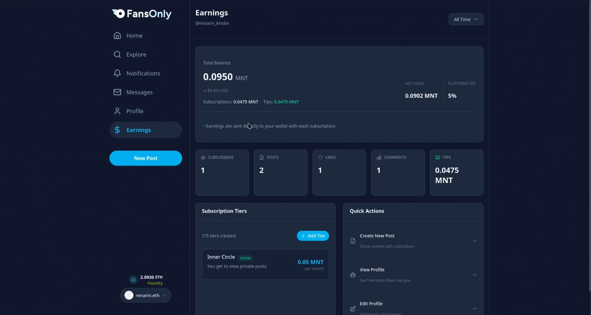

# FansOnly

A decentralized creator platform on Mantle Network for subscription-based content sharing with low fees and censorship resistance.

**Live Demo:** [fansonly-v1.vercel.app](https://fansonly-v1.vercel.app)

Built with NextJS, RainbowKit, Foundry, Wagmi, Viem, and TypeScript.

## Tech Stack

- **Frontend:** Next.js, React, TypeScript, Tailwind CSS, DaisyUI
- **Smart Contracts:** Solidity, Foundry
- **Blockchain:** Wagmi, Viem, RainbowKit
- **Storage:** Pinata SDK and IPFS
- **Network:** Mantle Network (Layer 2)

## Core Features

- **Low Platform Fees:** 5% platform fee, 95% to creators
- **Tier-Gated Access:** Subscription-based content access control
- **Custom Tiers:** Up to 5 subscription tiers with different pricing
- **Direct Payments:** Native MNT transactions
- **Immutable Profiles:** On-chain creator identity
- **Social Features:** On-chain likes and comments
- **Content Management:** Soft-delete for post management

## Screenshots

### Home Page

### Creator Profile

### Earnings Dashboard

### Tips & Donations

## Deployed Contracts

### Mantle Sepolia Testnet
- **CreatorProfile:** [0x3193fD94733e770aaCbd49c3B09Cb9DeFA928275](https://sepolia.mantlescan.xyz/address/0x3193fD94733e770aaCbd49c3B09Cb9DeFA928275)
- **ContentPost:** [0x611e728a07b3b6E4A1e77c48c5D15AB81c5D8dBa](https://sepolia.mantlescan.xyz/address/0x611e728a07b3b6E4A1e77c48c5D15AB81c5D8dBa)

## Requirements

- Node (>= v20.18.3)
- Yarn (v1 or v2+)
- Git

## Quickstart

1. Install dependencies: `yarn install`
2. Run local network: `yarn chain`
3. Deploy contracts: `yarn deploy` (or `yarn deploy --network mantleSepolia`)
4. Start app: `yarn start`
5. Visit: `http://localhost:3000`

## Project Status

- **Prototype:** Active development for Mantle ecosystem
- **Built with:** Scaffold-ETH 2
- **License:** MIT